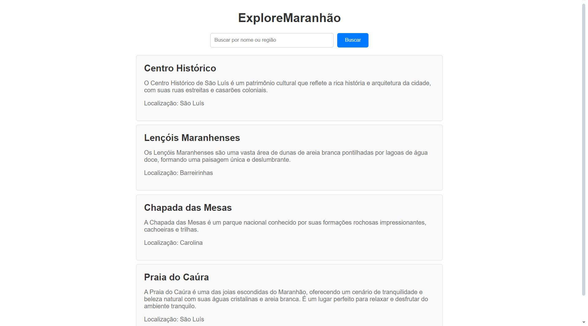
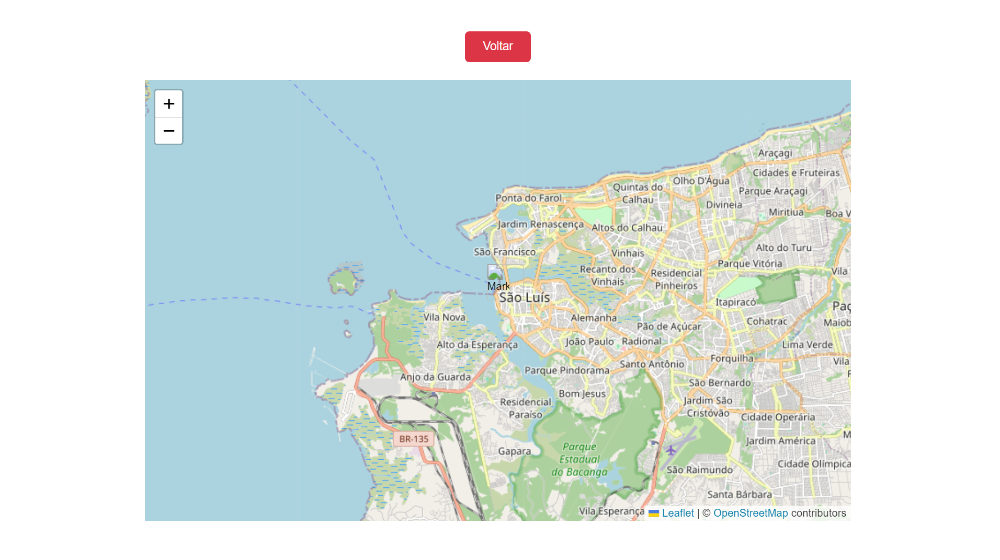
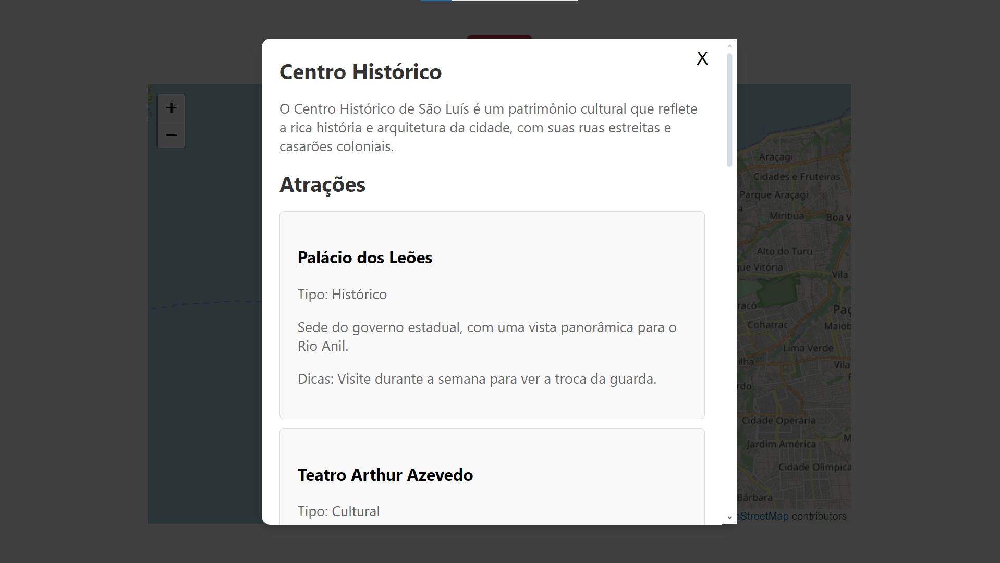

# Guia Turístico Online do Maranhão 

## Descrição

O ExploreMaranhão é um projeto que permite aos visitantes explorar os destinos turísticos mais populares do estado do Maranhão. A plataforma oferece informações detalhadas sobre cada destino, incluindo descrições, localização e atrativos. O objetivo é fornecer uma experiência intuitiva e informativa para os usuários interessados em conhecer os principais pontos turísticos da região.

## Tecnologias Utilizadas

- **Frontend**:
  - **React**: Biblioteca JavaScript para construir a interface de usuário.
  - **Leaflet**: Biblioteca para a criação de mapas interativos.
  - **CSS**: Estilização das páginas.

- **Backend**:
  - **Node.js**: Ambiente de execução JavaScript no servidor.
  - **Express**: Framework para criar APIs e gerenciar rotas.
  - **MySQL**: Banco de dados relacional para armazenar informações sobre destinos e atrativos.

- **Outras Ferramentas**:
  - **Axios**: Biblioteca para realizar requisições HTTP.
  - **Bootstrap**: Framework CSS para estilização e layout responsivo.

## Imagens

### Lista de Destinos



### Mapa



### Atrativos



## Como Rodar o Projeto

1. **Clone o Repositório**:
   ```bash
   git clone <URL_DO_REPOSITORIO>

2. **Instale as Dependências**:
Navegue até a pasta do projeto e instale as dependências para o frontend e backend:

-**Frontend**:
    bash
    Copiar código
    cd frontend
    npm install
    
-**Backend**:
    bash
    Copiar código
    cd backend
    npm install

3. **Configure o Banco de Dados**:
Certifique-se de que o MySQL está configurado e em execução, e que o banco de dados foi criado com a estrutura necessária.

4. **Inicie o Servidor Frontend**:
Navegue até a pasta backend e inicie o servidor:

    bash
    Copiar código
    npm start
    
5. **Inicie o Servidor Backend**:
Navegue até a pasta Backend e inicie o servidor:

    bash
    Copiar código
    npm start

-**O frontend estará acessível em http://localhost:3000 e o backend em http://localhost:3001.**

**Licença**
Este projeto está licenciado sob a Licença MIT - veja o arquivo LICENSE para detalhes.
